# Tux Manager

A Linux Task Manager alternative built with Qt6, inspired by the Windows Task Manager but designed to go further - providing deep visibility into system processes, performance metrics, users, and services.

[Open full-size screenshots](screenshots/screenshots.md)

## Screenshots (Dark Theme)

| CPU | Memory | GPU |
| --- | --- | --- |
| 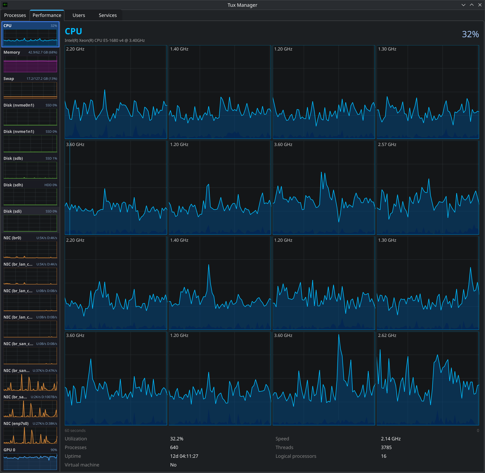 | 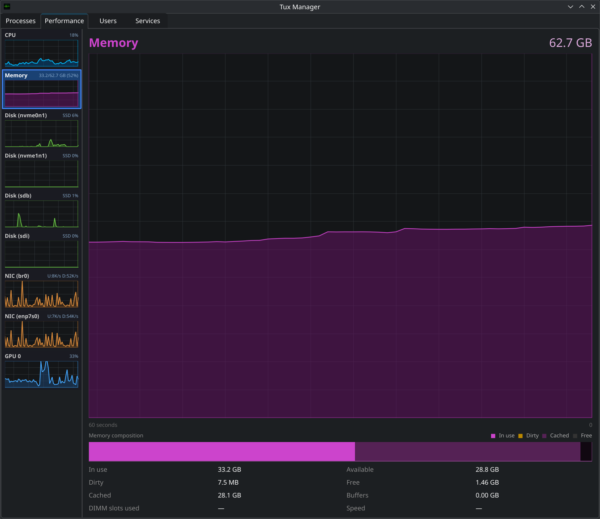 | 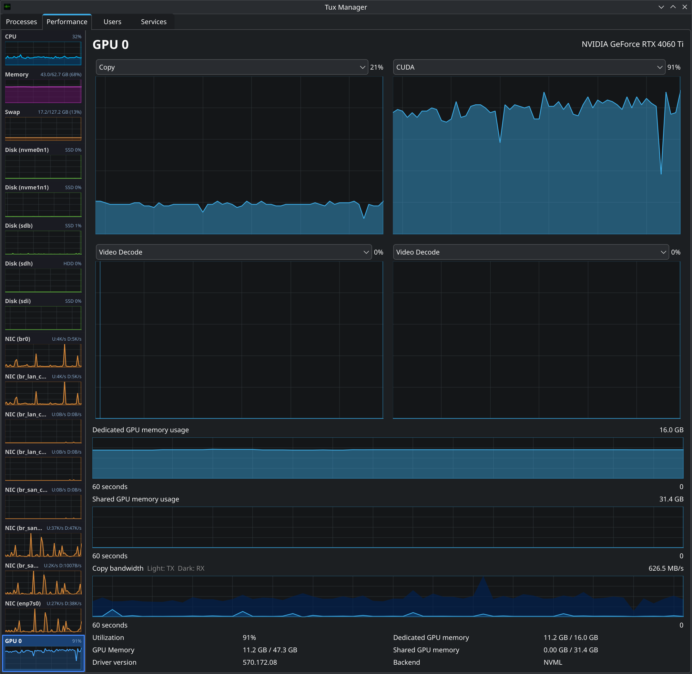 |

## Screenshots (Light Theme)

| CPU | Memory |
| --- | --- |
| 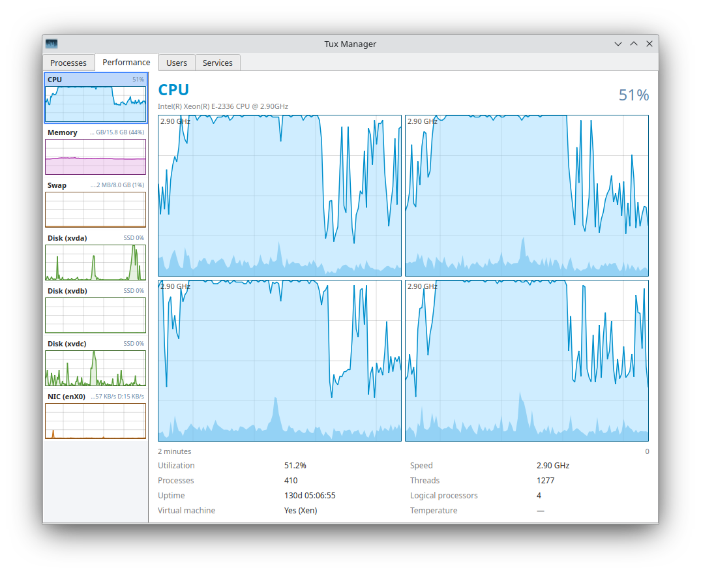 | 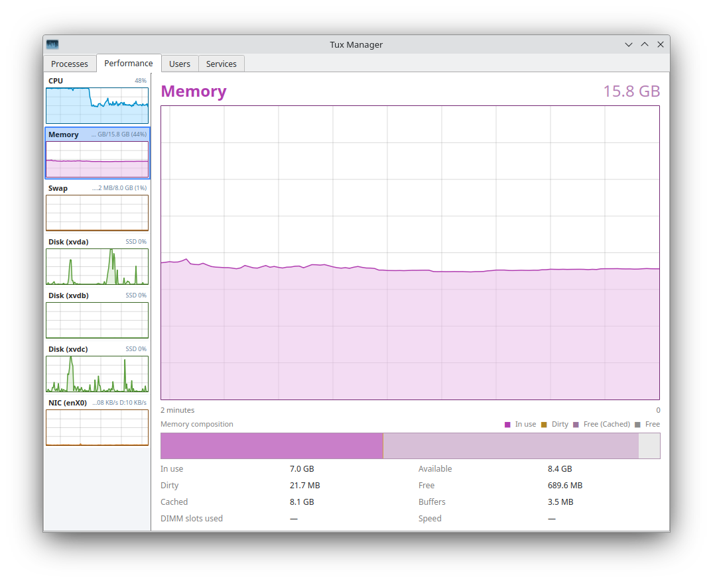 |
| Disk | Swap |
| 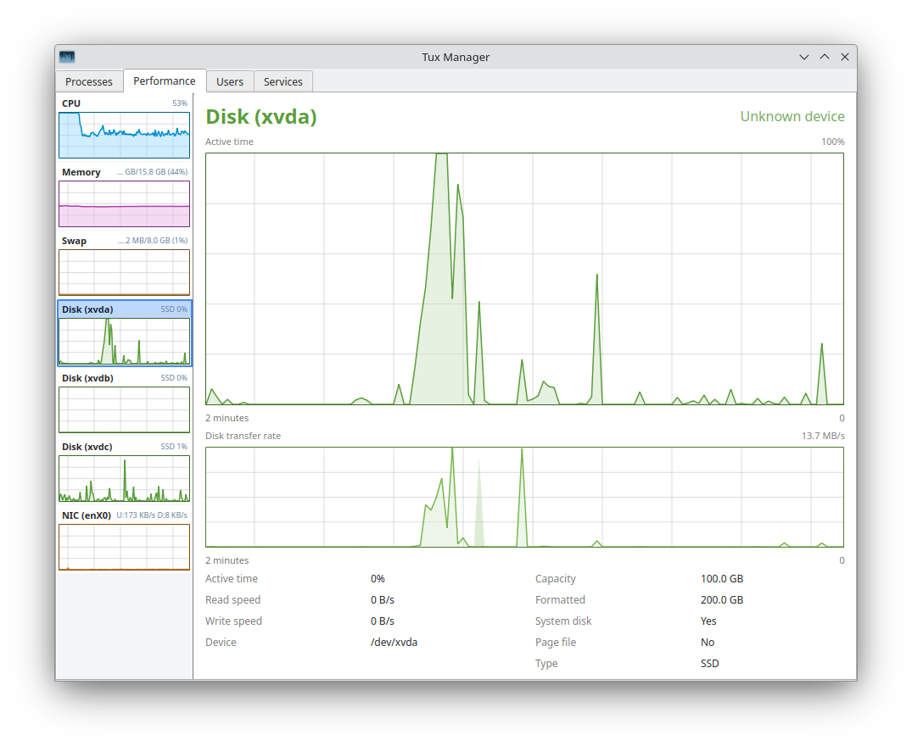 | 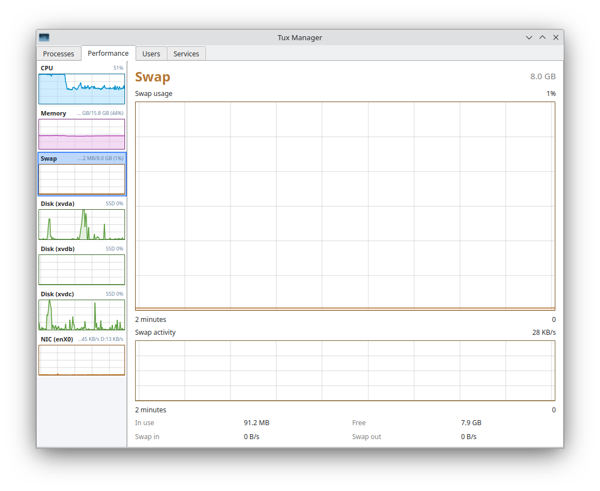 |
| Processes | Process tree |
| 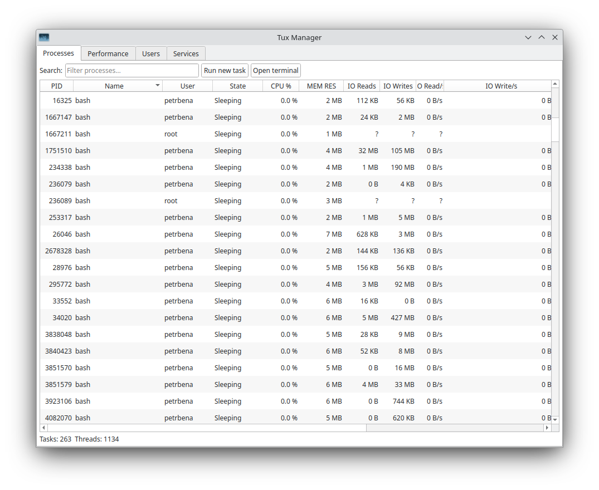 | 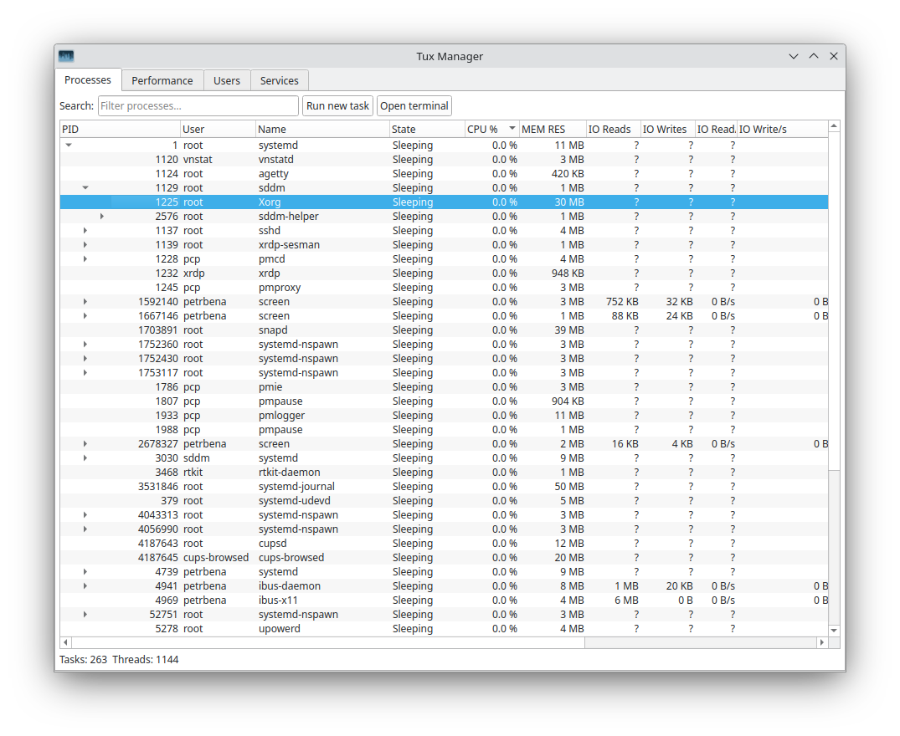 |
| Users | Services |
| 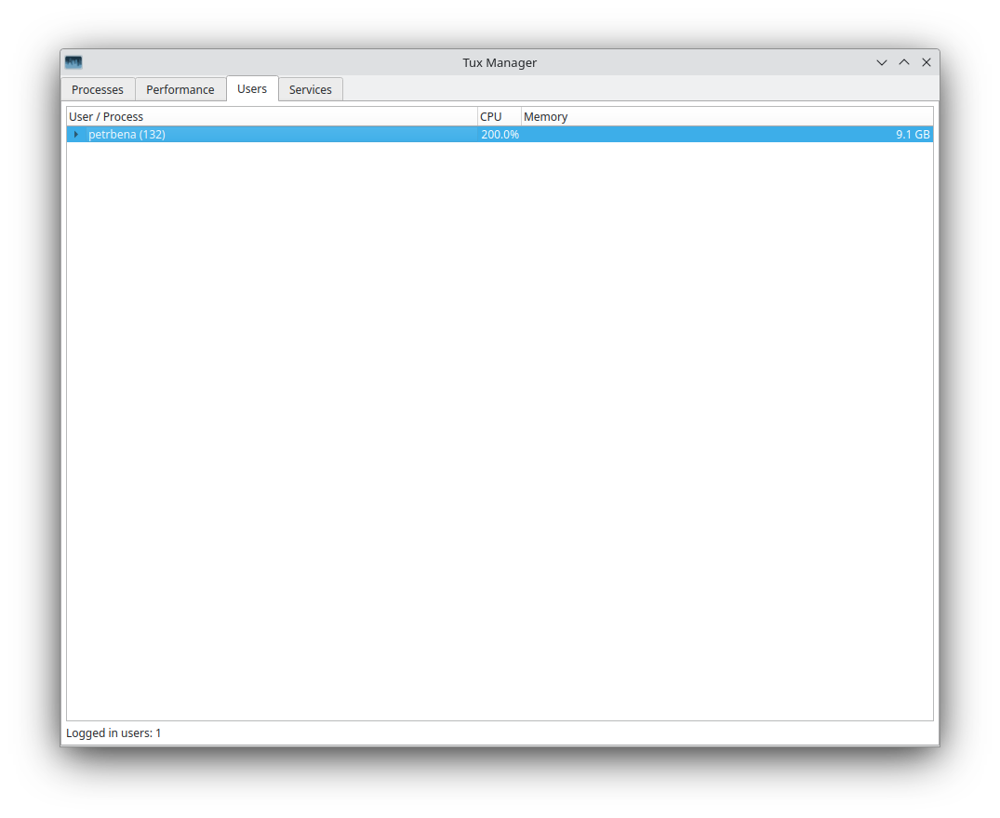 | 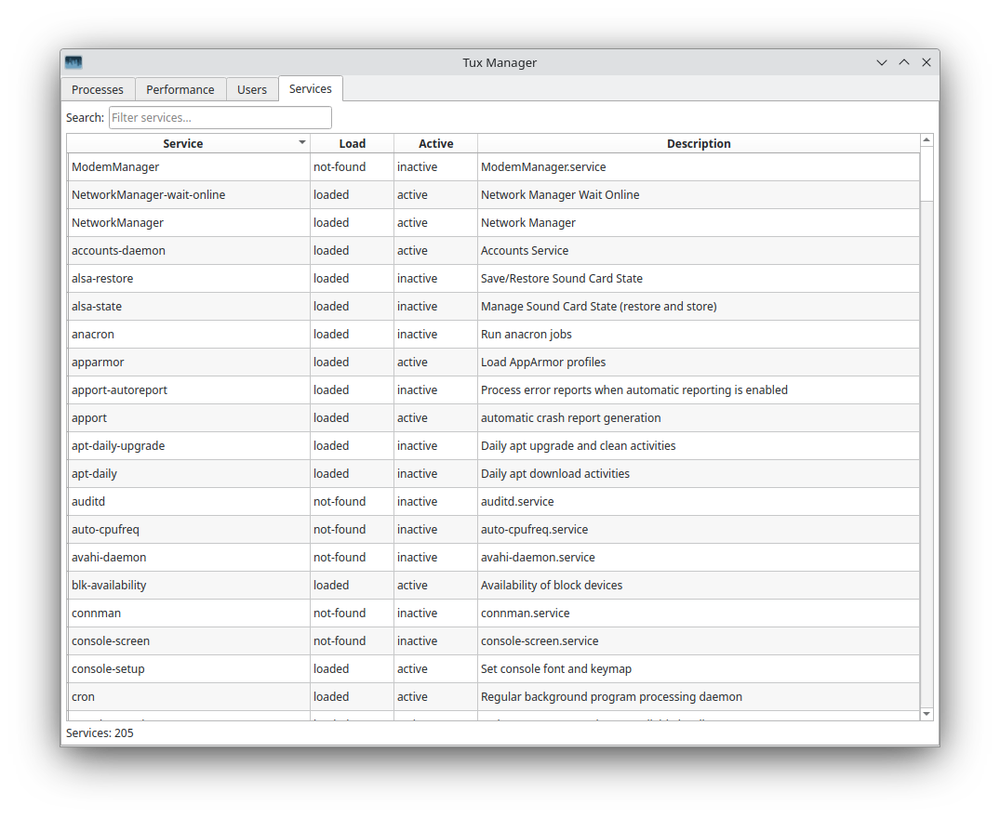 |

## Installing

### Debian / Ubuntu / Fedora / EL derivatives (Rocky/Alma/OL)
Use prebuilt packages that can be downloaded from [releases](https://github.com/benapetr/TuxManager/releases)

### AUR
Use an AUR helper like paru or yay:
```bash
yay -S tuxmanager
```

### Nix flake
Add the following to your `flake.nix`:
```nix
inputs.tuxManager.url = "github:benapetr/TuxManager/";
inputs.tuxManager.inputs.nixpkgs.follows = "nixpkgs"; # optional, deduplicates dependencies
```
You can then access the package at: `inputs.tuxManager.packages.${pkgs.stdenv.hostPlatform.system}.default`

### Others
You can use an AppImage that can be downloaded from releases or just [build it](#building) yourself.

## Building

### qmake

```bash
# cd to root of the repo and then:
mkdir build && cd build
qmake6 ../src
make -j$(nproc)
./tux-manager
```

## Core philosophy and goals of this project

* KISS - keep it simple stupid
* Lean and clean codebase, minimal system footprint (low RAM and CPU usage)
* Stability and reliability, easy debugging
* No overengineered or unnecessary extra features
* Simple packaging flow - for each packaging tool, there should be a script or 1 line command
* Minimal dependencies on 3rd party libs besides Qt so that building anywhere should be trivial
* Keep everything well documented

## License

GPL-3.0-or-later
